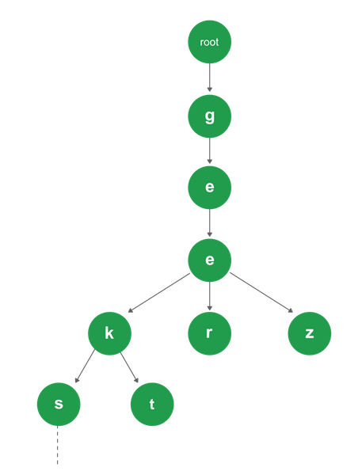

# Boogle Game

## Getting Started

These instructions will get you a copy of the project and help you run it on your local machine. 

### Technologies Used
* **Ruby on Rails** : Framework for building webapp and handling business logic  
* **React** : A Javascript library for building user-interface.
* **Redux** : For state management in react. In this app, it is also used for storing highscores and words.


### Prerequisities
* [****Ruby****](https://www.ruby-lang.org/en/documentation/installation/)
* ****Bundler**** : Bundler is a tool that manages gem dependencies for projects.
```sh
$ gem install bundler
```
* ****Rails : v6.0.2.1****
```sh
$ gem install rails -v 6.0.2.1
```
* [****Yarn****](https://classic.yarnpkg.com/en/docs/install#debian-stable) : Yarn is a package manager tool for javascript libraries.


### Installation
```sh
$ git clone https://github.com/anizzzzzzzz/BoggleGame.git
```

### Installing Dependencies
* ##### Open the console/terminal and navigate to the project directory.
```sh
$ cd ...path_to_project_director.../BoggleGame/
```

* ##### Install all the gem dependencies using bundler
```sh
$ bundle install
```

* ##### Install the javascript dependencies
```sh
$ yarn install
```
## Application Feature
##### Trie Data Structure
A trie is a tree-like, efficient information retrieval data structure whose nodes store the letters of an alphabet. By structuring the nodes in a particular way, words and strings can be retrieved from the structure by traversing down a branch path of the tree.

The application will load 218596 words from the dictionary **'./dictionary/new_dict.txt'** using Trie data structure during server initialization. 




## Starting up the Web Server
```
$ rails server
```

## Running the Test 
```
$ rails test
```